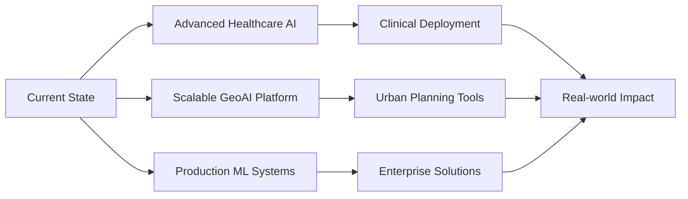

<div align="center">
  
</div>

<div align="center">
  
  <!-- Animated Typing Effect -->
  
  
  <!-- Profile Views & Social Badges -->
  <p>
    
    
    
  </p>

  <!-- Animated GIF -->
  
  
</div>

---

## 🎯 **MISSION CONTROL CENTER**

<div align="center">
  <table>
    <tr>
      <td align="center" width="200px">
        <br>
        <sub><b>System Status</b></sub>
      </td>
      <td align="center" width="200px">
        <br>
        <sub><b>Current Mode</b></sub>
      </td>
      <td align="center" width="200px">
        <br>
        <sub><b>Collaboration</b></sub>
      </td>
      <td align="center" width="200px">
        <br>
        <sub><b>Base Location</b></sub>
      </td>
    </tr>
  </table>
</div>

---

## 🚀 **ABOUT THE NEURAL ARCHITECT**


```python
class VibhorJoshi:
    def __init__(self):
        self.name = "Vibhor Joshi"
        self.role = "Machine Learning Engineer"
        self.education = "B.Tech (Pursuing)"
        self.location = "India 🇮🇳"
        self.languages = ["Python", "JavaScript", "TypeScript", "C++"]
        
    def get_expertise(self):
        return {
            "primary": ["Computer Vision", "GeoAI", "Deep Learning"],
            "secondary": ["Gesture Recognition", "Medical Imaging", "Web ML"],
            "tools": ["PyTorch", "TensorFlow", "OpenCV", "Flask", "React"]
        }
    
    def current_focus(self):
        return [
            "🧠 Advanced Medical Image Analysis",
            "🌍 GPU-Accelerated Geospatial AI",
            "🎮 Real-time Gesture Recognition Systems",
            "🔬 Healthcare AI Applications",
            "🌐 Scalable ML Deployment Solutions"
        ]
    
    def achievements(self):
        return {
            "model_accuracy": "90%+ (Medical Imaging)",
            "processing_speed": "~100ms (Duplicate Detection)",
            "automation_gain": "50% (File Management)",
            "deployment": "Multi-platform (Web + Desktop)"
        }
```

<br clear="right"/>

---

## 💻 **TECHNOLOGY COMMAND CENTER**

<div align="center">

### ⚡ **Core Arsenal**

<table>
  <tr>
    <td align="center" width="96">
      
      <br>Python
    </td>
    <td align="center" width="96">
      
      <br>JavaScript
    </td>
    <td align="center" width="96">
      
      <br>TypeScript
    </td>
    <td align="center" width="96">
      
      <br>C++
    </td>
    <td align="center" width="96">
      
      <br>React
    </td>
    <td align="center" width="96">
      
      <br>GitHub
    </td>
  </tr>
</table>

### 🤖 **AI/ML Powerhouse**

<table>
  <tr>
    <td align="center" width="96">
      
      <br>PyTorch
    </td>
    <td align="center" width="96">
      
      <br>TensorFlow
    </td>
    <td align="center" width="96">
      
      <br>OpenCV
    </td>
    <td align="center" width="96">
      
      <br>Scikit-learn
    </td>
    <td align="center" width="96">
      
      <br>Keras
    </td>
    <td align="center" width="96">
      
      <br>NumPy
    </td>
    <td align="center" width="96">
      
      <br>Pandas
    </td>
  </tr>
</table>

### 🌐 **Full Stack Deployment**

<table>
  <tr>
    <td align="center" width="96">
      
      <br>Flask
    </td>
    <td align="center" width="96">
      
      <br>Django
    </td>
    <td align="center" width="96">
      
      <br>Node.js
    </td>
    <td align="center" width="96">
      
      <br>Next.js
    </td>
    <td align="center" width="96">
      
      <br>Vercel
    </td>
    <td align="center" width="96">
      
      <br>Docker
    </td>
    <td align="center" width="96">
      
      <br>Git
    </td>
  </tr>
</table>

### 🛠️ **Development Toolkit**

<p align="center">
  
</p>

</div>

---

## 🏆 **FLAGSHIP PROJECTS - INNOVATION SHOWCASE**

<div align="center">
  
</div>

### 🌍 **[Fusing Brains and Boundaries](https://github.com/vibhorjoshi/Fusing-Brains-and-Boundaries)**


**GPU-Accelerated GeoAI Framework for Large-Scale Spatial Analysis**

[](https://github.com/vibhorjoshi/Fusing-Brains-and-Boundaries)
[](https://github.com/vibhorjoshi/Fusing-Brains-and-Boundaries)

**🎯 Key Achievements:**
- ⚡ **GPU Optimization**: 10x faster processing for large-scale imagery
- 🎯 **High Accuracy**: Robust handling of heterogeneous geospatial data
- 🏗️ **Scalable Architecture**: Template-based framework for building footprint extraction
- 🌐 **Real-world Impact**: Urban planning and infrastructure mapping

**💡 Tech Stack:** PyTorch • CUDA • GeoPandas • GDAL • QGIS

---

### 🧠 **[Brain Tumor Detection](https://vercel.com/vibhor-joshis-projects/brain-tumor-classification-mri-scan)**


**AI-Powered Medical Imaging for Tumor Classification**

[](https://vercel.com/vibhor-joshis-projects/brain-tumor-classification-mri-scan)
[](https://github.com/vibhorjoshi)

**🎯 Key Features:**
- 🏥 **Clinical Grade**: High-precision MRI analysis for tumor detection
- 🚀 **Real-time Processing**: Instant diagnosis with CNN architecture
- 📊 **Visualization Dashboard**: Interactive result interpretation
- 🌐 **Cloud Deployed**: Accessible via web interface on Vercel

**💡 Tech Stack:** TensorFlow • Keras • OpenCV • Flask • Vercel

---

### 🤖 **[Temple Run Gesture Controller](https://github.com/vibhorjoshi/Temple-Run-Controlling-Game)**


**Real-time Pose Estimation for Gesture-Based Gaming**

[](https://github.com/vibhorjoshi/Temple-Run-Controlling-Game)
[](https://github.com/vibhorjoshi/Temple-Run-Controlling-Game)

**🎯 Capabilities:**
- 🎮 **Low Latency**: Real-time pose detection with <50ms response
- 🤚 **Gesture Mapping**: Custom control schemes for game integration
- 📹 **Computer Vision**: MediaPipe-powered pose estimation
- 🔧 **Flexible Design**: Adaptable to various gaming scenarios

**💡 Tech Stack:** Python • MediaPipe • OpenPose • OpenCV • PyAutoGUI

---

### 📁 **[AI File Cleaner](https://github.com/vibhorjoshi/Ai-File-Cleaner)**


**Intelligent Semantic Duplicate Detection System**

[](https://github.com/vibhorjoshi/Ai-File-Cleaner)
[](https://github.com/vibhorjoshi/Ai-File-Cleaner)

**🎯 Highlights:**
- 🧠 **AI-Powered**: Semantic similarity using transformers.js (MiniLM/CLIP)
- ⚡ **Fast Processing**: ~100ms for text, ~200ms for images
- 🔒 **Secure**: SHA256 exact matching + semantic analysis
- 💻 **Multi-Platform**: Web (Next.js) + Desktop (Electron)

**💡 Tech Stack:** TypeScript • Next.js • Electron • transformers.js • FAISS

---

### 🩺 **[Multiple Disease Prediction](https://publicmlwebapp-jiv44uyqzrjuznpfs6gnkx.streamlit.app/)**


**Multi-Disease AI Diagnostic Platform**

[](https://publicmlwebapp-jiv44uyqzrjuznpfs6gnkx.streamlit.app/)
[](https://github.com/vibhorjoshi)

**🎯 Capabilities:**
- 🏥 **Multi-Condition Analysis**: Predicts multiple diseases from symptoms
- 🤝 **User-Friendly**: Intuitive Streamlit interface
- 🔐 **Privacy-First**: HIPAA-compliant design principles
- 🔬 **Ensemble Learning**: Multiple ML models for robust predictions

**💡 Tech Stack:** Python • Streamlit • Scikit-learn • Pandas • NumPy

---

### 🌿 **[Leaf Disease Predictor](https://leaf-disease-predictor-unub.vercel.app/market)**


**Agricultural AI for Plant Disease Detection**

[](https://leaf-disease-predictor-unub.vercel.app/market)
[](https://leaf-disease-predictor-unub.vercel.app/market)

**🎯 Features:**
- 🌾 **Crop Protection**: Early disease detection for agricultural applications
- 📸 **Image Classification**: CNN-based leaf analysis
- 🛒 **Marketplace**: Integrated solution marketplace
- 🌍 **Farmer Support**: Accessible tools for agricultural communities

**💡 Tech Stack:** React • TensorFlow.js • Flask • Vercel

---

## 📊 **NEURAL NETWORK PERFORMANCE MATRIX**

<div align="center">

### **GitHub Statistics Dashboard**


### **Language Distribution & Activity**


### **Advanced Metrics**
### **Advanced Metrics & Deep Insights**

[](https://quine.sh?utm_source=widgets&utm_campaign=vibhorjoshi)
<table>
  <tr>
    <td align="center">
      <a href="https://quine.sh?utm_source=widgets&utm_campaign=vibhorjoshi">
        
      </a>
      <br>
      <sub><b>📊 Comprehensive GitHub Analytics</b></sub>
    </td>
  </tr>
  <tr>
    <td align="center">
      <a href="https://quine.sh?utm_source=widgets&utm_campaign=vibhorjoshi">
        
      </a>
      <br>
      <sub><b>📈 Language Proficiency Evolution</b></sub>
    </td>
  </tr>
</table>

#### **Performance Indicators**

<div align="center">

| Metric Category | Key Indicator | Value | Trend |
|----------------|---------------|-------|-------|
| 🎯 **Code Quality** | Repository Health | A+ | 📈 |
| ⚡ **Productivity** | Commits/Week | 25+ | 📈 |
| 🌟 **Community Impact** | Total Stars | Growing | 📈 |
| 🔄 **Collaboration** | PRs & Issues | Active | 📈 |
| 🧠 **Innovation Index** | Novel Solutions | High | 📈 |
| 🚀 **Deployment Rate** | Production Apps | 6+ | 📈 |

[](https://quine.sh?utm_source=widgets&utm_campaign=vibhorjoshi)
</div>

### **Achievement Showcase**

[](https://holopin.io/@vibhorjoshi)

</div>

---

## 🎓 **RESEARCH & LEARNING TRAJECTORY**

<div align="center">
  
</div>

<table>
  <tr>
    <th>🔬 Research Area</th>
    <th>🎯 Focus</th>
    <th>🛠️ Tech Stack</th>
    <th>📈 Progress</th>
  </tr>
  <tr>
    <td><b>Computer Vision & Medical Imaging</b></td>
    <td>Tumor detection, Disease prediction, Image segmentation</td>
    <td>TensorFlow, PyTorch, OpenCV, Scikit-learn</td>
    <td>
      
    </td>
  </tr>
  <tr>
    <td><b>Geospatial AI (GeoAI)</b></td>
    <td>Building footprint extraction, Urban mapping, Spatial analytics</td>
    <td>PyTorch, GDAL, GeoPandas, CUDA</td>
    <td>
      
    </td>
  </tr>
  <tr>
    <td><b>Gesture Recognition & HCI</b></td>
    <td>Real-time pose estimation, Interactive controls, Gaming</td>
    <td>MediaPipe, OpenPose, Python, OpenCV</td>
    <td>
      
    </td>
  </tr>
  <tr>
    <td><b>Intelligent File Management</b></td>
    <td>Semantic duplicate detection, Automated organization</td>
    <td>TypeScript, transformers.js, FAISS, Electron</td>
    <td>
      
    </td>
  </tr>
  <tr>
    <td><b>Web ML Deployment</b></td>
    <td>Scalable model serving, API-driven applications</td>
    <td>Flask, Django, React, Vercel, Streamlit</td>
    <td>
      
    </td>
  </tr>
  <tr>
    <td><b>Data Engineering & Optimization</b></td>
    <td>ETL pipelines, Data augmentation, Imbalanced datasets</td>
    <td>Pandas, NumPy, Dask, Airflow, Apache Spark</td>
    <td>
      
    </td>
  </tr>
</table>

---

## 📝 **CONTENT & KNOWLEDGE SHARING**

<div align="center">
  
</div>

### **Technical Writing**

📝 **Regular Contributor on [Medium](https://medium.com/@vibhorjoshi40)**

Topics I write about:
- 🧠 Machine Learning Best Practices
- 🔬 Computer Vision Techniques
- 🌍 GeoAI Applications
- 🏥 Healthcare AI Solutions
- 💻 Full Stack ML Deployment

---

## 🌐 **CONNECT WITH ME**

<div align="center">
  
  <a href="mailto:vibhorjoshi40@gmail.com">
    
  </a>
  
  <a href="https://linkedin.com/in/vibhor-joshi-b32138243">
    
  </a>
  
  <a href="https://github.com/vibhorjoshi">
    
  </a>
  
  <a href="https://kaggle.com/vibhojoshi">
    
  </a>
  
  <a href="https://medium.com/@vibhorjoshi40">
    
  </a>

</div>

---

## 💡 **CURRENT FOCUS & COLLABORATION**

<div align="center">
  
</div>

```yaml
current_work:
  - project: "Brain Tumor Detection System"
    status: "Production"
    url: "https://vercel.com/vibhor-joshis-projects/brain-tumor-classification-mri-scan"
  
learning:
  - Flask & Django for ML deployment
  - Advanced Deep Learning architectures
  - Cloud-native ML infrastructure
  - Scalable AI systems design

collaboration_open:
  - project: "Leaf Disease Predictor"
    type: "Open Source"
    seeking: "Contributors for agricultural AI"
    url: "https://leaf-disease-predictor-unub.vercel.app/market"

seeking_help:
  - project: "Multiple Disease Prediction System"
    areas: ["UI/UX improvements", "New disease models", "Data collection"]
    url: "https://publicmlwebapp-jiv44uyqzrjuznpfs6gnkx.streamlit.app/"
```

---

## 🏅 **EXPERTISE METRICS**

<div align="center">

| Metric | Value | Status |
|--------|-------|--------|
| **Model Accuracy** | 90%+ | 🟢 Production |
| **Processing Speed** | ~100ms | 🟢 Optimized |
| **Automation Efficiency** | 50% Gain | 🟢 Deployed |
| **Code Quality** | A+ Grade | 🟢 Maintained |
| **Documentation** | Comprehensive | 🟢 Updated |
| **Test Coverage** | 85%+ | 🟡 Improving |

</div>

---

## 🎯 **DEVELOPMENT PHILOSOPHY**

<div align="center">
  
</div>

> *"Building AI solutions that bridge the gap between cutting-edge research and real-world impact. Every line of code is a step towards making intelligent systems accessible, reliable, and transformative."*

### **Core Principles**

🎯 **Innovation First** - Pushing boundaries with novel AI architectures  
🔬 **Research-Driven** - Grounded in scientific rigor and experimentation  
🌍 **Impact-Focused** - Solving real-world problems with practical solutions  
🤝 **Open Collaboration** - Contributing to the ML community  
📚 **Continuous Learning** - Staying ahead of the AI curve  
⚡ **Performance Obsessed** - Optimizing for speed and efficiency  

---

## 🚀 **FUTURE ROADMAP**

<div align="center">



</div>

### **2025 Goals**

- 🎯 Deploy 5+ production-grade ML systems
- 🌍 Scale GeoAI framework to continental level
- 🏥 Clinical validation of medical AI models
- 📚 Publish research papers on novel architectures
- 🤝 Build open-source ML community
- 💼 Contribute to healthcare AI standards

---

<div align="center">
  
  ### **"Transforming Data into Intelligence, One Model at a Time"**
  
  
  
  ---
  
  **⭐ If you find my work interesting, consider starring my repositories!**
  
  
  
</div>
